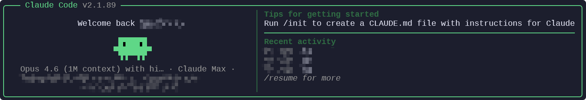

# ClawGod

[English](README.md) | [中文](README_ZH.md) | [日本語](README_JP.md)

> God mode for [Claude Code](https://docs.anthropic.com/en/docs/claude-code).

**This is NOT a third-party Claude Code client.** ClawGod is a runtime patch applied on top of the official Claude Code. It works with any version — as Claude Code updates, the patch continues to take effect.

## Install

**macOS / Linux:**
```bash
curl -fsSL https://github.com/0Chencc/clawgod/releases/latest/download/install.sh | bash
```

**Windows (PowerShell):**
```powershell
irm https://github.com/0Chencc/clawgod/releases/latest/download/install.ps1 | iex
```

Green logo = patched. Orange logo = original.



## What it does

### Feature Unlocks

| Patch | What you get |
|-------|-------------|
| **Internal User Mode** | 24+ hidden commands (`/share`, `/teleport`, `/issue`, `/bughunter`...), debug logging, API request dumps |
| **GrowthBook Overrides** | Override any feature flag via config file |
| **Agent Teams** | Multi-agent swarm collaboration, no flags needed |
| **Computer Use** | Screen control without Max/Pro subscription (macOS) |
| **Ultraplan** | Multi-agent planning via Claude Code Remote |
| **Ultrareview** | Automated bug hunting via Claude Code Remote |

### Restriction Removals

| Patch | What's removed |
|-------|---------------|
| **CYBER_RISK_INSTRUCTION** | Security testing refusal (pentesting, C2, exploits) |
| **URL Restriction** | "NEVER generate or guess URLs" instruction |
| **Cautious Actions** | Forced confirmation before destructive operations |
| **Login Notice** | "Not logged in" startup reminder |

### Visual

| Patch | Effect |
|-------|--------|
| **Green Theme** | Brand color → green. Patched at a glance |
| **Message Filters** | Shows content hidden from non-Anthropic users |

## Commands

```bash
claude              # Patched Claude Code
claude.orig         # Original unpatched version
```

## Configuration

`~/.clawgod/provider.json` is auto-created on first run. Setting `apiKey` lets you skip OAuth entirely and point ClawGod at any Anthropic-compatible endpoint.

```json
{
  "apiKey": "sk-ant-...",
  "baseURL": "https://api.anthropic.com",
  "model": "",
  "smallModel": "",
  "timeoutMs": 3000000
}
```

- **`apiKey` set** → ClawGod injects it as `ANTHROPIC_API_KEY` and isolates from `~/.claude/settings.json`. Works with Anthropic, DeepSeek, and OpenAI-compatible gateways. A non-Anthropic `baseURL` also populates `ANTHROPIC_AUTH_TOKEN` for gateway auth.
- **`apiKey` empty** → OAuth path. Run `claude auth login` once; `~/.claude` keeps hosting your subagents, skills, and MCP settings.

## Update

Re-run the installer to get the latest version with patches re-applied:

**macOS / Linux:**
```bash
curl -fsSL https://github.com/0Chencc/clawgod/releases/latest/download/install.sh | bash
```

**Windows:**
```powershell
irm https://github.com/0Chencc/clawgod/releases/latest/download/install.ps1 | iex
```

## Uninstall

**macOS / Linux:**
```bash
curl -fsSL https://github.com/0Chencc/clawgod/releases/latest/download/install.sh | bash -s -- --uninstall
hash -r  # refresh shell cache
```

**Windows:**
```powershell
irm https://github.com/0Chencc/clawgod/releases/latest/download/install.ps1 -OutFile install.ps1; .\install.ps1 -Uninstall
```

> After install or uninstall, restart your terminal or run `hash -r` if the command doesn't take effect immediately.

## Requirements

- Node.js >= 18 + npm
- Claude Code login (`claude auth login`) **or** an API key in `~/.clawgod/provider.json` (see [Configuration](#configuration))

## License

GPL-3.0 — Not affiliated with Anthropic. Use at your own risk.
